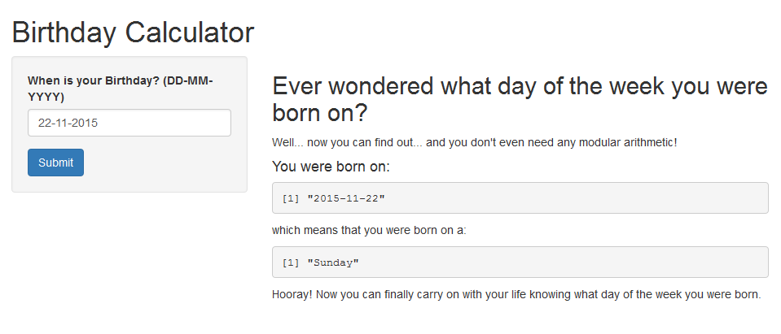

## Description of the Birthday Calculator

* This application is a very basic app written using the Shiny package in RStudio.

* The purpose of the app is to calculate what day of the week the user was born on.

* The app has one input value - the date of your birthday.

* The app has one output value - the day of the week to which your birthday corresponds.

--- 

## Goals

* Ever since my birthday last month, I was curious as to whether the day of the week this year was the same as the day of the week on which I was born.

* I thought it would be nice if there was a simple app for this in Shiny for those who have a similar curiosity (or those who can't be bothered figuring out the commands in R).

--- 

## Example 



--- 

## Relevant Code

Conveniently, there is a function in the R base package called ```weekdays()``` which converts any date to the corresponding week day. For the input ```birthday``` variable, the output was calculated using:


```r
weekdays(as.Date(input$birthday,'dd-mm-yyyy'))
```

The ```ui.R``` script accommodated for a header, a side panel and a main panel. For example the side panel was created as follows:


```r
sidebarPanel(
               dateInput('birthday', 'When is your Birthday? (DD-MM-YYYY)', 
                         value= Sys.Date(), format = 'dd-mm-yyyy') ,
               submitButton('Submit')
)
```

--- 

## Conclusion

* My Shiny app was obviously a very basic app and in total probably took me aroud 3 hours to write the app and these slides.

* Given more time I would have liked to include plots to show what proportions of people were born on the user's birthday and even include other fun facts surrounding the input day.


